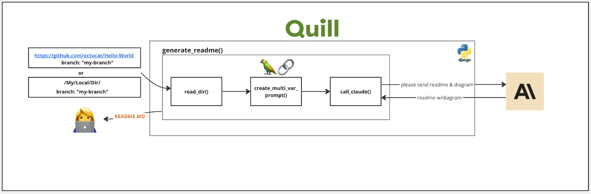
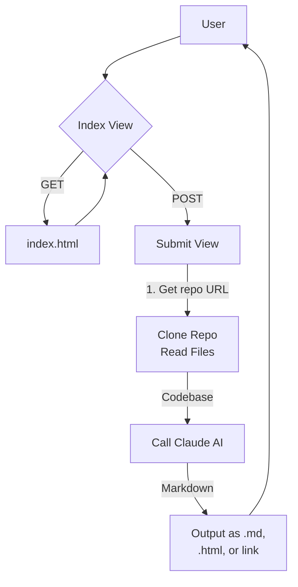

# Quill

A Django web application that generates README files for code repositories. 

## Table of Contents

- [About](#about)
- [Getting Started](#getting_started)
- [Usage](#usage)
- [Contributing](../CONTRIBUTING.md)

## About <a name="about"></a>

Quill is a web app built with Django that allows users to input a GitHub repo URL and branch name. It will then download the repo code, analyze it, and generate a custom README.md file summarizing the project. 

Key features:

- Parse local directories or clone remote GitHub repos
- Auto-generate table of contents
- Customizable templates
- Output as .md file, .html, or URL link  



## Getting Started <a name="getting_started"></a>

These instructions will get you a copy of the project up and running on your local machine for development and testing purposes.

### Prerequisites

Requirements for running the Quill app:

```
- Python 3.6+
- Django 4.2+
- Markdown and Mermaid libraries
```

### Installing

Clone the repository locally:

```
git clone https://github.com/yourname/Quill.git
```

Install dependencies:

```
pip install -r requirements.txt
```

Make migrations:

```
python manage.py makemigrations
python manage.py migrate
```

Run development server:

```
python manage.py runserver
```

The app will now be running at `http://localhost:8000`.

## Usage <a name="usage"></a>

The main workflow is:

1. User submits GitHub repo URL and (optional) branch name

2. Quill clones the repo and reads all .py files 

3. The codebase is passed to Claude AI to generate a custom README

4. User downloads the .md file or views it formatted as HTML

For example, to generate a README for https://github.com/anthropic/claude-quickstart:

```
Visit http://localhost:8000
Enter https://github.com/anthropic/claude-quickstart into the form
Click "Submit"
```

This will generate and download a README.md summarizing the repo.



## Contributing

Please reach out for contribution guidelines.

## PS: This readme was generated with the help of Quill!

