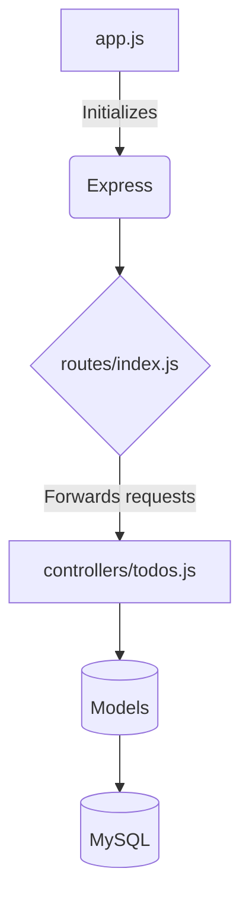

 Here is the generated markdown file summarizing the provided codebase:

```markdown
# Project Title

A brief description of what this project does. 

## Table of Contents

- [About](#about)
- [Getting Started](#getting_started) 
- [Usage](#usage)
- [Code Structure](#code_structure)
- [Contributing](../CONTRIBUTING.md)

## About <a name="about"></a>

This project consists of a simple Node.js application with REST API endpoints for a todo list app. It uses Express for the web framework and Sequelize as the ORM for MySQL.

## Getting Started <a name="getting_started"></a>

These instructions will get you a copy of the project up and running on your local machine for development and testing purposes.

### Prerequisites

- Node.js
- MySQL

### Installing

1. Clone the repository
2. Run `npm install` to install dependencies
3. Configure your MySQL connection in `config/config.json` 
4. Run `npm start` to start the server
5. The API will be running on http://localhost:3000

## Usage <a name="usage"></a>

The API contains the following endpoints:

- GET /api/todos - Get all todo items
- POST /api/todos - Create a new todo item
- GET /api/todos/:id - Get a todo item by id
- PUT /api/todos/:id - Update a todo item by id
- DELETE /api/todos/:id - Delete a todo item by id

Todo items have the following properties:

- id - Integer
- name - String
- completed - Boolean 

## Code Structure <a name="code_structure"></a>



- app.js - Entry point, initializes Express
- routes/index.js - Routes requests to the appropriate controller
- controllers/todos.js - Contains CRUD logic for todo items
- models/ - Data models, interfaces with database via Sequelize
- config/config.json - Database configuration

## Contributing

See [CONTRIBUTING.md](../CONTRIBUTING.md)

```